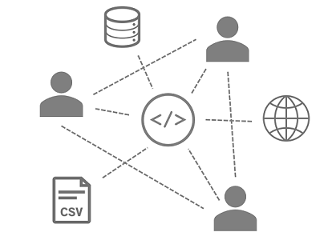

# Introduction

## About the Tool
**The ICJIA R&A's Web Dataset Maintenance (WDM) Tool** is a Python program that provides the ICJIA R&A staff with an easy-to-use command-line interface to carrying out tasks of maintaining and updating datasets to be published online.

The WDM Tool is designed to automate as much as possible the work of fetching new records from a variety of data sources and packaging them into a dataset product to be published on [the ICJIA website location for downloadable datasets](http://www.icjia.state.il.us/research/overview#tab_research-data).

### Simple workflow

The WDM Tool provides simple interface to make the work of dataset maintenance as easy as typing an input letter and pressing enter.

The program does the work by connecting to a variety of data sources, thus relieving you as much as possible from the need to juggle many pieces of software simultaneously.

### Enabling collaboration

The simple interface makes it possible for the R&A staff to collaborate efficiently and keep the published data products up-to-date. No more waiting until the single mastermind returns from his or her sweet vacation to make the latest data available for the public.

### Modern, machine-friendly output format
The final dataset output generated by the WDM Tool is formatted so that its data file(s) can be easily imported into and analyzed by popular data analysis and statistics tools with minimal additional reshaping of the data.

In addition, the WDM Tool separates data and metadata into `.csv` and `.txt` files, respectively, rather than combining all into a single Excel Workbook file. The resulting dataset outputs are much more lightweight and require no commercial software to open.

## About this documentation
The current documentation is prepared to allow you to do the following:

* Set up your workstation computer to be able to use the Tool
    * [Prerequisites](./prerequisites.md)
* Navigate the Tool to carry out intended tasks (updating and generating datasets)
    * [Getting Started](./start.md)
    * [User Guide](./guide.md)
* Know the datasets, their format, and the data sources
    * [Data Outputs](./output.md)
    * [Data Sources](./source.md)
* Understand how the program and its parts work
    * [Database](./database.md)
    * [Program](./program.md)