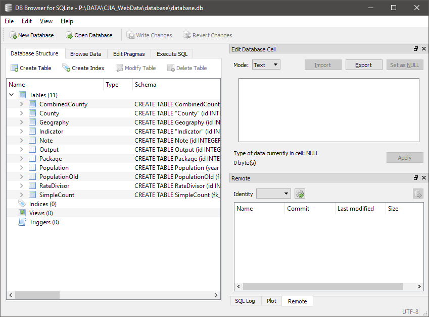

# Database

## SQLite

> *"SQLite is an in-process library that implements a self-contained, serverless, zero-configuration, transactional SQL database engine. [...] SQLite is the most widely deployed database in the world with more applications than we can count, including several high-profile projects."*

The Web Dataset Maintenance (WDM) Tool uses SQLite to build 
SQLite is freely available at [the official SQLite website](https://www.sqlite.org/index.html).

## DB Browser for SQLite

Although a SQLite database file can be accessed and modified programmatically, it is still conveninent to use a graphical tool to browse the database file and make minor changes if needed.

For that, the current documentation recommends DB Browser for SQLite, previously known as SQLite Browser, for a graphical user interface software tool providing a to SQLite database files. It is freely downloadable from [its official website](https://sqlitebrowser.org/), which introduces DB Browser for SQLite as follows:

> *"DB Browser for SQLite is a high quality, visual, open source tool to create, design, and edit database files compatible with SQLite."*

Once DB Browser is downloaded and installed, you can use it to open SQLite database file (`.db`). The following screenshot image shows the graphical user interface to a `.db` file:

::: tip
To find more about hwo to use the DB Browser for SQLite, visit [its official documentation Wiki pages on GitHub](https://github.com/sqlitebrowser/sqlitebrowser/wiki). 
:::

## Tables
The WDM Tool's data is stored in the `/database/database.db` file, which contains a number of tables described in the rest of this section.

::: warning NOTE
The WDM Tool's database structure is drawn from the one used in the previous datasets maintenance practice. Accoringly, there are tables or columns that appear somewhat redundant or unused. This may change in future.     
:::

### "CombinedCounty"
The "CombinedCounty" table contains information regarding cases in which data for multiple counties are reported by a single county or a separate body of organization. 

The "CombinedCounty" table has the following columns:

* `id` (INTEGER): Unique indentifier for combined county records.
* `fk_combinedcounty_indicator` (INTEGER): A foreign key to the "Indicator" table.
* `year` (INTEGER): Year when the given combined county record is applicable.
* `fk_container_county` (INTEGER): A foreign key to the "County" table for the reporting county.
* `fk_contained_county` (INTEGER): A foreign key to the "County" table for the county reporting its data via another county.

### "County"
The "County" table contains information on Illinois counties and their characteristics.

The "County" table has the following columns:

* `id` (INTEGER): Unique identifier for each county.
* `fips_number` (REAL): The Federal Information Process Standard (FIPS) number for each county. 
* `county_name` (TEXT): County name.
* `judicial_circuit` (TEXT): The Illinois circuit court under whose jurisdiction each  county falls. 
* `fk_county_geography` (REAL): A foreign key to the "Geography" table.
* `alphabetical_oder` (REAL): The number of each county in alphebetical order.
* `region` (TEXT): Region of the county: Northern minus Cook, Northern - Cook, Central, or Southern
* `community_type` (TEXT): Categorization based on the proportion of rural area in a county: 1) "Completely Rural" means 100% rural,  2) "Mostly rural" means >50% rural, 3) "Mostly urban" means <50% rural, and 4) "Completely urban" means 0% rural
* `percent_rural` (REAL): Percentage of rural area in a county

### "Geography"
The "Geography" table contains information on geography type variable and their definitions.

The "Geography" table has the following columns:

* `id` (INTEGER): Unique indentifier for each geography type.
* `description` (TEXT): Description of each geography type.

### "Indicator"
The "Indicator" table contains information about each "indicator", a unique idenetifier for a specific variable whose records are collected by the ICJIA and incoporated into its published datasets. For instance, the indicator number of 100 corresponds to Continued Under Supervision/Delinquency variable in the Juvenile Petitions Continued Under Supervision/Adjudications table of the Administration Office of the Illinois Courts' Annual Report of the Illinois Courts.

::: warning NOTE
See [the previous "Data Sources" section](./source.md) for the link between indicator values and their sources.
:::

The "Indicator table has the following columns:

* `id` (INTEGER): Unique identifier for each indicator.
* `description` (TEXT): Description of each indicator.
* `source` (TEXT): 
* `note` (TEXT): Internal note for each indicator.
* `public_note` (BLOB): Public note for each indicator.
* `adult_or_juvenile` (TEXT): "A" if the given indicator is applicable to adults only, "J" if applicable to juveniles only, "B" if both.
* `fk_indicator_population_indicator` (REAL): A foreign key to the "PopulationOld" table.
* `fk_indicator_ratedivisor` (REAL): A foreign key to the "RateDivisor" table.
* `fk_indicator_output` (REAL): A foreign key to the "Output" table.
* `name` (TEXT): Name of each indicator.

### "Note"
The "Note" table contains notes from the previous dataset maintenance system.

The "Note" table has the following columns:

* `id` (INTEGER): Unique identifier for each note.
* `note_text` (TEXT): Body text of each note.

### "Output"
The "Output" table contains information about each output data file, especially the information that will be saved as a metadata file.    

The "Output" table has the following columns:

* `id` (INTEGER): Unique identifier for each output table.
* `source_group` (INTEGER): Source group of each output table: 1 is AOIC, 2 is CHRI, 3 is IDOC, 4 is IDJJ, 5 is ISP, and 6 is others.
* `name` (TEXT): Name of each output table (as in the resulting `.csv` file).
* `old_name` (TEXT): Name of each output table as in the previous dataset maintenance system.
* `standard` (INTEGER): 1 if the table is in the standard format, 0 otherwise.
* `active` (INTEGER): 1 if the table is actively maintained, 0 otherwise.
* `fk_output_package` (INTEGER): A foreign key to the "Package" table.
* `name_full` (TEXT): Full name of each output table; included in the metadata.
* `source` (TEXT): Output data source.
* `year_type` (TEXT): Type of year: Calandar or Fiscal; included in the metadata.
* `year_min` (REAL): Minimum year value (for the earliest records); included in the metadata.
* `year_max` (REAL): Maximum year value (for the latest records); included in the metadata.
* `description` (TEXT): Description of each output; included in the metadata.
* `notes` (TEXT): Notes for each output; included in the metadata file.
* `column_name` (TEXT): A list of column names; included in the metadata.
* `column_info` (TEXT): A list of column descriptions; included in the metadata.

### "Package"
The "Package" table has the following columns:

* `id` (INTEGER): Unique identifier for each packaged dataset output.
* `name` (TEXT): Name for each packaged dataset output.

### "Population"
The "Population" table contains population records drawn from [U.S. Census Populations With Bridged Race Categories](https://www.cdc.gov/nchs/nvss/bridged_race.htm) by the National Vial Statistics System. The records are in a disaggregated format--by year, county, bridged race group and gender, ethnicity (hispanic or not), and age--as in the original format. Records in this table are used for obtaining the population base for calculating the relevant rates in the dataset outputs.

The "Population" table has the following columns:

* `year` (INTEGER): Year of each record.
* `fk_population_county` (INTEGER): A foreign key to the "County" table.
* `age` (INTEGER): .
* `race_gender` (INTEGER): .
* `hispanic` (INTEGER): .
* `value` (INTEGER): Data value.

### "PopulationOld"
The "PopulationOld" table contains population records drawn from [U.S. Census Populations With Bridged Race Categories](https://www.cdc.gov/nchs/nvss/bridged_race.htm) by the National Vial Statistics System--in an old, aggregated format. The table is no longer maintained beyond the 2016 population estimates.

The "PopulationOld" table has the following columns:

* `fk_population_county` (INTEGER): A foreign key to the "County" table.
* `year` (INTEGER): Year of each record.
* `fk_population_indicator` (INTEGER): A foreign key to the "Indicator" table.
* `value` (INTEGER): Data value.

### "RateDivisor"
The "RateDivisor" table contains information about how to calculate the rate for each data variable.

The "RateDivisor" table has the following columns:

* `id` (INTEGER): Unique identifier for each rate divisor type.
* `description` (TEXT): Description of each rate divisor type.

### "SimpleCount"
The "SimpleCount" table is a storage for all the actual values from data sources except for the population estimates.

The "SimpleCount" table has the following columns:

* `fk_simplecount_indicator` (INTEGER): A foreign key to the "Indicator" table.
* `fk_simplecount_county` (INTEGER): A foreign key to the "County" table.
* `year` (INTEGER): Year of each record.
* `value` (REAL): Data value.
