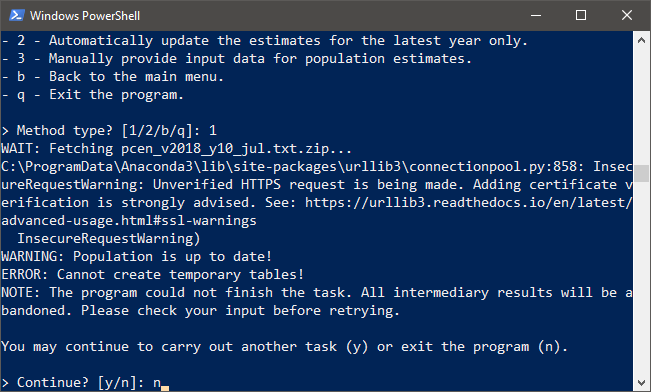
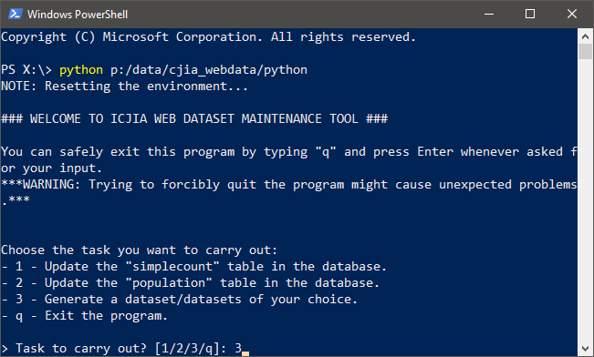

# User Guide

::: warning NOTE
See [the previous "Getting Started" section](./start.md) to see how to start the program.
:::

The Web Dataset Maintanence (WDM) Tool allows you to carry out three key tasks required to keep the underlying database updated and generate datasets from the database. These task include:

1. Update the "SimpleCount" table in the database.
2. Update the "Population" table in the database.
3. Generate packaged dataset outputs

The first and second tasks require appropriate data inputs and, once completed, change the corresponding tables in the database file, `/database/database.db`. The third task does not require data input but uses records in the database; once completed, new packaged dataset zipfile is stored in `/datasets/` subdirectory.

::: tip
See [the "Database" section](./database.md) to learn more about the structure of the database that holds all the underlying records used to generate datasets.  
:::

## Update the "SimpleCount" table

The "SimpleCount" table holds most of the actual data records used to generate the packaged dataset outputs. In order to get an updated dataset, one must first update this table to have the latest numbers ready.

### Update automatically
The WDM Tool offers an option to automatically update records drawn from a selection of data sources. Currently, automatic updating is available for the following data:

* Criminal History Records Information
    * Juvenile arrests (Microsoft SQL Server)
* Illinois Department of Corrections
    * Prison admissions (Microsoft SQL Server)
* Illinois Department of Juvenile Justice 
    * Juvenile court admissions and exits (Microsoft SQL Server).
* Illinois State Police
    * Uniform Crime Report (online).
* Other sources
    * Illinois County Jail Population (Network drive P:/DATA/JAIL/).
    * Local Area Unemployment Statistics (Online).
    * Small Area Income and Poverty Estimates (Online).

### Update manually
Manually updating the "SimpleCount" table is available for all types of recrods. This requires a data input file in a specific format, i.e., that of the "SimpleCount" table, which looks like the following:

| fk_simplecount_indicator | year | fk_simplecount_county | value |
| ------------------------ | ---- | --------------------- | ----- |
| 10 | 2018 | 1 | 50 |
| 10 | 2018 | 2 | 75 |
| ... | ... | ... | ... |

::: warning NOTE
See [the "Database" section](./database.md) to learn more about the "SimpleCount" table and its columns. Also, see [the "Data Sources" section](./source.md) to find which indicator code corresponds to which data.
:::

### Command-line interface Workflow

#### *Automatically* update the "SimpleCount" table
1. Start the WDM Tool on PowerShell (e.g., `python p:\data\cjia_webdata\python`)
2. Choose: Update the "simplecount" table in the database (`1 + "Enter"`)
3. Choose: Automatically update database records from select data sources (`1 + "Enter"`)
4. Choose the data source group for updating the table (`[input] + "Enter"`)
5. Specify the data source updating the database (`[input] + "Enter"`)
6. Review the temporary result generated in `/temp/`, i.e. `TemplSimpleCount.csv`
7. Confirm that the temporary result is as expected (`y + "Enter"`)
8. Restart the process (`y + "Enter"`), or quit the program (`n + "Enter"`)

#### *Manually* update the "SimpleCount" table
1. Start the WDM Tool on PowerShell (e.g., `python p:\data\cjia_webdata\python`)
2. Choose: Update the "simplecount" table in the database (`1 + "Enter"`)
3. Choose: Manually provide input data for updating database records (`2 + "Enter"`)
4. Place a correctly formated input file in `/input/`
5. Confirm that the input file is in the correct directory (`y + "Enter"`)
6. Confirm that the duplicates rows will be overwritten (`y + "Enter"`)
7. Review the temporary result generated in `/temp/`, i.e. `TemplSimpleCount.csv`
8. Confirm that the temporary result is as expected (`y + "Enter"`)
9. Restart the process (`y + "Enter"`), or quit the program (`n + "Enter"`)

## Example 1
::: warning NOTE
The following example illustrates the process of automatically updating the "SimpleCount" table with the latest prison admissions records from the MS SQL Server.

In this scenario, the program generates temporary outputs but the user decides *not* to finish the task, exiting the program before updating the database.
:::

  
 
 
 
  
  

## Update the "Population" table

The "Population" table keeps the actual county-level population estimates used to generate the packaged dataset outputs. This is what is used to calculate "rate" column values.

### Update automatically
Updating "Population" table is a fully automated task. In fact, to minimize the chances of human errors, the current documentation strongly recommends using an automatic option for adding the latest population estiamtes to the table.

### Update manually
Although not recommended, the WDM Tool also offers an option to mannually update the table. The process is largely identical to that of manually updating the "SimpleCount" data described above. The "Population" table format is as follows:

| year | fk_population_county | age | race_gender | hispanic | value |
| --- | --- | --- | --- | --- | --- |
| 2018 | 1 | 0 | 1 | 1 | 100 |
| 2018 | 1 | 1 | 1 | 1 | 150 |
| 2018 | 1 | 2 | 1 | 1 | 125 |
| ... | ... | ... | ... | ... | ... |

::: warning NOTE
See [the "Database" section](./database.md) to learn more about the "Population" table and its columns.
:::

### Command-line interface workflow

#### *Automatically* update the "Population" table 
1. Start the WDM Tool on PowerShell (e.g., `python p:\data\cjia_webdata\python`)
2. Choose: Update the "population" table in the database (`2 + "Enter"`)
3. Choose: Automatically update all estimates since the latest census year (`1 + "Enter"`)
    * Alternatively, choose: Automatically update the estimates for the latest year only (`2 + "Enter"`)
4. Review the temporary result generated in `/temp/`, i.e. `TemplPopulation.csv`
5. Confirm that the temporary result is as expected (`y + "Enter"`)
6. Restart the process (`y + "Enter"`), or quit the program (`n + "Enter"`)

#### *Manually* update the "Population" table
1. Start the WDM Tool on PowerShell (e.g., `python p:\data\cjia_webdata\python`)
2. Choose: Update the "population" table in the database (`2 + "Enter"`)
3. Choose: Manually provide input data for population estimates. (`3 + "Enter"`)
4. Place a correctly formated input file in `/input/`
5. Confirm that the input file is in the correct directory (`y + "Enter"`)
6. Review the temporary result generated in `/temp/`, i.e. `TemplPopulation.csv`
7. Confirm that the temporary result is as expected (`y + "Enter"`)
8. Restart the process (`y + "Enter"`), or quit the program (`n + "Enter"`)

## Example 2
::: warning NOTE
The following example illustrates the process of automatically updating the "Population" table.

In this scenario, the "Population" table is already up-to-date, so the program throws an error.
:::

  
  
  

## Generate a dataset/datasets

You can use the WDM Tool to easily generate packaged dataset outputs in the zipfile format base on the updated records in the database. Generate dataset zipfiles are stored in `/dataset/`. 

::: tip
See [the "Data Outputs" section](./output.md) to find what datasets are available to be generated using the WDM Tool.
:::

### Command-line interface Workflow
1. Start the WDM Tool on PowerShell (e.g., `python p:\data\cjia_webdata\python`)
2. Choose: Generate a dataset/datasets of your choice (`3 + "Enter"`)
3. Specify the data source group for generating datasets (`[input] + "Enter"`)
4. Choose the dataset package to generate (`[input] + "Enter"`)
5. Restart the process (`y + "Enter"`), or quit the program (`n + "Enter"`)

## Example 3
::: warning NOTE
The following example illustrates the process of generating the `ucr_index_crime` dataset output using the command-line interface to the WDM Tool.

In this scenario, the dataset is successfully generated and stored in `/datasets/`. The user then chooses to continue to the next task.
:::

  
  
  
  
  
