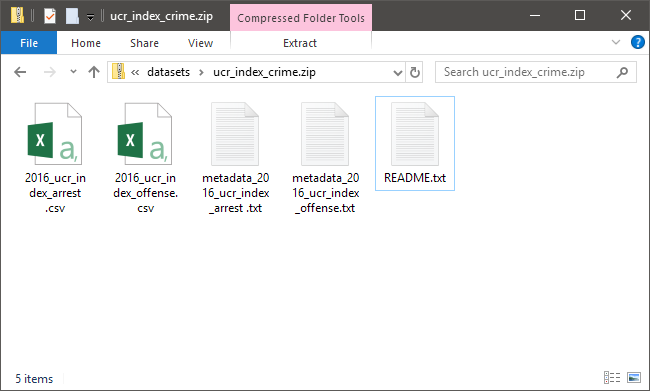
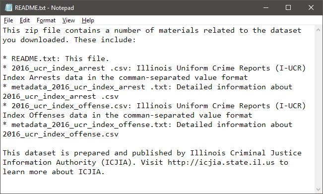
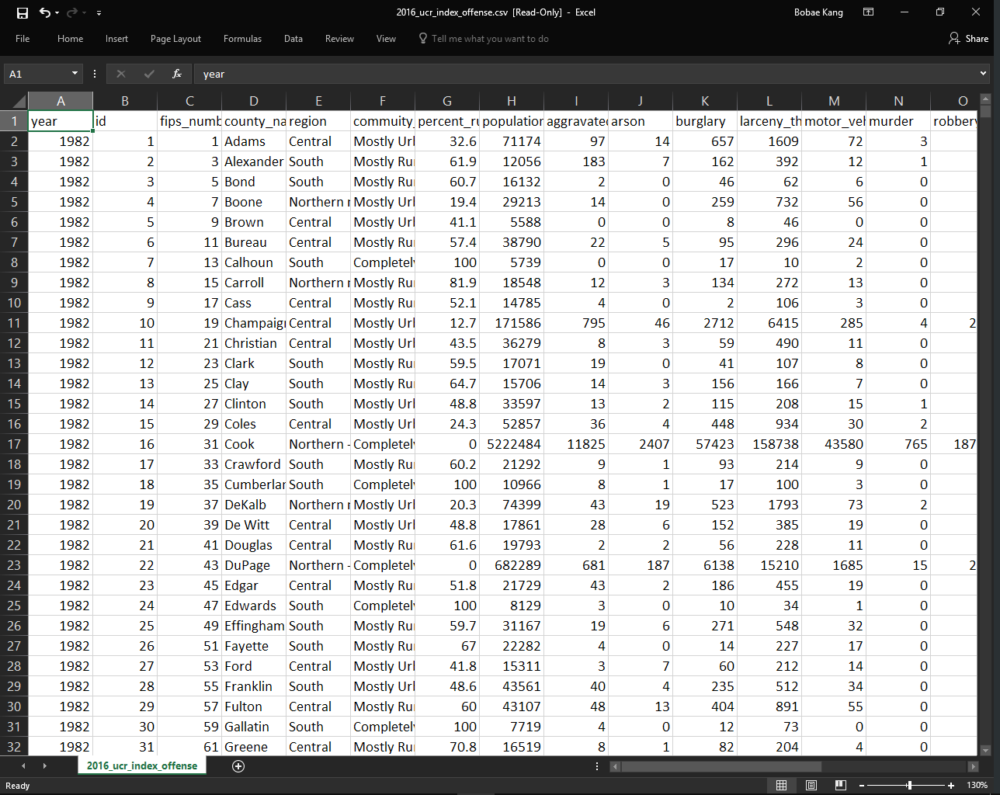

# Data Outputs

## Format and contents
Each packaged dataset output is a zipfile (`.zip`) containing multiple files for the actual data as well as relevant metadata. Although the number of data files vary from one packaged dataset to another, in general, each output package is structured as follows:

```
data_package.zip
├─ README.txt
├─ yyyy_metadata_data_one.txt
├─ yyyy_data_one.csv
├─ yyyy_metadata_data_two.txt
└─ yyyy_data_two.csv
```

The image below shows the content of a generated dataset package named `ucr_index_crime.zip` for the Uniform Crime Report Index Crime offense and arrest data:



### `README` file
Each packaged output contains one `README.txt` text file providing a list as well as brief description of all the zipfile contents. See the following image for an example of the `REAMD.txt` file:



### `metadata` file
A metadata text file is generated per data file and offers detailed information about the data file. Accordingly, if the given packaged dataset output contains more than one data file, it would also contain a matching number of metadata files. See the following image for an example:


### `data` file
A data comma-seperated values (`.csv`) file is generated using the records saved in the database file. Common to all data files are the following columns:

* `year`: Data year
* `id`: Location (county) ID
* `fips_num`: Location (coutny) Federal Information Processing Standard (FIPS) code
* `county_name`:  County name
* `region`: Region of the county (Northern minus Cook, Northern - Cook, Central, or Southern)
* `community_type`: Categorization based on the proportion of rural area in a county
* `percent_rural`: Percentage of rural area in a county
* `population`: Population count 

In addition to the common columns, most data files include columns for both raw count values and population-adjusted rate values for relevant data. See the following image for an example of a data file opened in Microsoft Excel:



::: warning NOTE
Although the image above shows the file in Microsoft Excel, the file itself is a comma-separated values (`.csv`) text file that can be opened using any text editor, including Notepad.
:::

## Dataset list
At the time of writing, there are total 26 packaged datasets that are actively maintained and available for the use of the Web Dataset Maintenance Tool to generate automatically.

::: tip
See  [the following "Data Sources" section](./source.md) to find more about the data sources.
:::

### Based on AOIC data
The following packaged datasets are generated using data from the Administrative Office of the Illinois Courts (AOIC), more specifically, the statistical summary document of its [Annual Report of the Illinois Courts](http://www.illinoiscourts.gov/SupremeCourt/AnnReport.asp).

* `active_juvenile_caseload`: Active juvenile probation caseloads
* `criminal_caseload`: Criminal court filings
* `felony_sentence`: Felony sentences
* `juvenile_adjudication`: Juvenile adjudications
* `juvenile_investigation`: Youth investigations for probation
* `juvenile_petition`: Juvenile petitions
* `juvenile_placement`: Juvenile placements
* `order_protection`: Orders of protection

### Based on CHRI data
The following packaged datasets are generated using the Criminal History Record Information (CHRI) data from the internal Microsoft SQL Server (`SPAC2SVR`).

* `juvenile_arrest`: Juvenile arrests in CHRI

### Based on IDOC data
The following packaged datasets are generated using the Illinois Department of Corrections (IDOC) data from the internal Microsoft SQL Server (`SPAC2SVR`).

* `prison_admission`: Total new court admissions to IDOC

### Based on IDJJ data
The following packaged datasets are generated using the Illinois Department of Juvenile Justice (IDJJ) data from the internal Microsoft SQL Server (`SPAC2SVR`).

* `juvenile_court_admission`: Admissions into IDJJ facilities
* `juvenile_court_exit`: Exits from IDJJ facilities

### Based on ISP data
The following packaged datasets are generated using [the annual Uniform Crime Report data](http://www.isp.state.il.us/crime/ucrhome.cfm) originally published by the Illinois State Police. 

* `ucr_domestic_crime_offense`: Domestic crime offenses
* `ucr_hate_crime_offense`: Hate crime offenses
* `ucr_drug_arrest`: Drug arrests
* `ucr_human_trafficking`: Human trafficking arrests
* `ucr_index_crime`: Index crime (violent and property) offenses and arrests
* `ucr_school_indicent`: School incident offenses

The following package dataset is generated using the Illinois State Police data obtained via email.

* `drug_seizure_submission`: Drug Seizures and Submissions

### Based on other data sources
The following packaged datasets come from a variety of other sources.

* `child_abuse`: Reported and indicated child abuse/neglect and child sexual abuse offenses
* `county_jail`: County jail bookings
* `juvenile_detention`: Admissions into juvenile detention
* `elder_abuse`: Elder abuse offenses
* `employment`: Labor force population, employment, and unemployment data
* `illinois_population_estimates`: Illinois population estimates
* `illinois_poverty_estimates`: Illinois poverty estimates