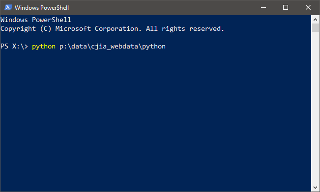

# Getting Started
::: warning NOTE
Make sure to take all the steps in [the previous "Prerequisites" section](./prerequisites.md) prior to following the steps in the current section.
:::

## Start the program
The Web Dataset Maintanence (WDM) Tool is a Python program located at `P:\DATA\CJIA_Webdata\python`. To execute the Tool, open up Windows PowerShell and run the following command:

```
> python p:\data\cjia_webdata\python
```



Alternatively, you can first move to the directory where the program is stored and run the program using the following command:

```
> cd p:\data\cjia_webdata\python
> python .
```


::: tip
`cd [location]` is a Windows PowerShell command you can use to move to a specific location in the computer. To learn more about Windows Powershell, visit [the official documentation website](https://docs.microsoft.com/en-us/powershell/) by Microsoft. 
:::

Either way, the `python ...` command will execute the program. After a few seconds, the interface to the Tool will appear as shown in the following image:


**Congratulations**:tada: Now you are ready to get some work done!

## Interact with the Tool
The WDM Tool interface is designed to first receive a user input and then carry out appropriate tasks. Therefore, at each step, the Tool will ask you for an input with possible options wait. You can provide the Tool with an input by typing the number or character that matches the desired task and hit `<Enter>` so that the Tool knows what it is supposed to do.

Once you submit your input by hitting that `<Enter>` button, the Tool will move on to the next step, which might require additional inputs from you. Simply follow along the instructions on the screen to get the desired result, i.e. updating its database with new records or generating packaged dataset product.

::: tip
You will find out more about which tasks the current Tool can carry out and how the interface would look like for those tasks in [the following User Guide section](./guide.md).  
:::

## Safely exit the program
::: danger
Trying to forcibly quit the program might cause unexpected problems!
:::

At each step, the Tool offers an input option to safely exit the program, ususally with the `q` input.

Although it is possible to forcibly quit the program (e.g. by manually closing the PowerShell window or exiting the program from Task Manager), such an action might lead to erroneous behaviors, which may include failing to clean up temporary outputs in the database or to finish updating the database file.

Therefore, it is *strongly recommended* that you exit the program using the provided interface by `q + <Enter>` or other appropriate option.